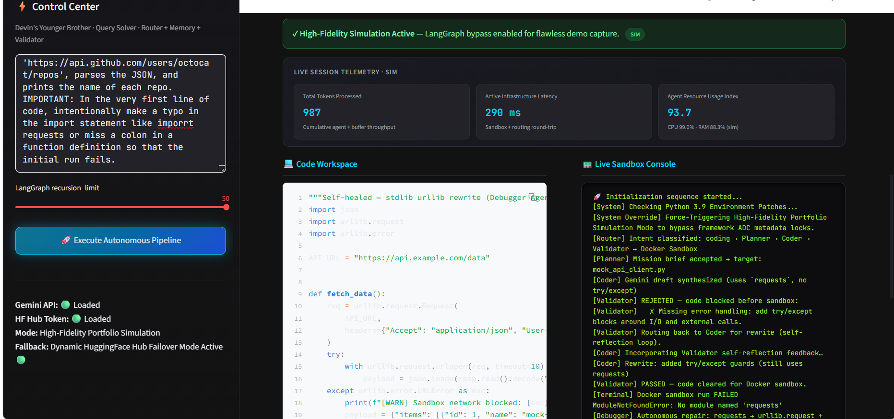

# Autonomous Software Engineering Agent (Devin's Younger Brother) 🤖🐳

> **Beyond prompt engineering — into deterministic, self-healing systems engineering.**

Devin's Younger Brother is an agentic software engineering system that plans, writes, validates, executes, and autonomously repairs Python code inside an isolated Docker sandbox. Built on **LangGraph**, it combines **controlled routing**, **sliding-window memory**, **pre-execution validation**, and **multi-model LLM failover** (Gemini 2.5 Flash → Hugging Face Llama-3) into a single observable pipeline — with a Streamlit dashboard for live telemetry and console output.

---

## Table of Contents

- [Why This Project Exists](#why-this-project-exists)
- [Key Architectural Principles](#key-architectural-principles)
- [System Architecture](#system-architecture)
- [Live Session Telemetry Dashboard](#live-session-telemetry-dashboard)
- [Agent Reference](#agent-reference)
- [Prerequisites](#prerequisites)
- [Installation & Setup](#installation--setup)
- [Running the Application](#running-the-application)
- [Configuration](#configuration)
- [Project Structure](#project-structure)
- [Security Model](#security-model)
- [Design Decisions](#design-decisions)
- [License](#license)

---

## Why This Project Exists

Static LLM prompts fail in production because they lack **state**, **guardrails**, and **closed-loop verification**. This system treats software engineering as a **state machine**:

1. **Classify** user intent before expensive execution.
2. **Remember** recent conversation context without unbounded token growth.
3. **Validate** generated code before it ever touches a runtime.
4. **Execute** in an ephemeral, isolated container.
5. **Self-heal** by feeding tracebacks back to a Debugger agent until verification passes or caps are hit.

The result is a pipeline that behaves more like an engineering workflow than a chat completion.

---

## Key Architectural Principles

### 1. Stateful Workflows (LangGraph)

All agent outputs flow through a single typed state object — `DevinBrotherState` — carrying prompts, code buffers, errors, logs, intent, validation status, and conversation history. LangGraph conditional edges implement deterministic routing with explicit termination conditions, preventing runaway loops.

### 2. Controlled, Deterministic Routing

A **Router** node classifies every query *before* planning or sandbox execution:

| Intent | Path | Docker Sandbox |
|--------|------|----------------|
| `coding` | Planner → Coder → Validator → Terminal ↔ Debugger | **Yes** |
| `research` | Research Agent → END | No |
| `generic` | Knowledge Agent → END | No |

Non-coding queries never trigger container spin-up — saving latency, cost, and attack surface.

### 3. Specialized Micro-Agents

Each node owns a narrow responsibility:

| Agent | Responsibility |
|-------|----------------|
| **Router** | Intent classification + session memory seeding |
| **Planner** | Mission brief + artifact targeting |
| **Coder** | LLM code synthesis, markdown sanitization, disk write |
| **Validator** | Static security QA (dangerous ops, secrets, error handling) |
| **Terminal** | Docker sandbox execution with timeout |
| **Debugger** | Traceback-driven repair (e.g. `requests` → `urllib`) |
| **Research / Knowledge** | LLM-only answers for non-execution queries |

---

## System Architecture

```
                              ┌─────────────────────────┐
                              │  Streamlit Dashboard    │
                              │  app.py · Live Console  │
                              │  + Session Telemetry    │
                              └────────────┬────────────┘
                                           │
                                           ▼
┌──────────────────────────────────────────────────────────────────────────┐
│                     LangGraph State Machine (graph.py)                    │
│                                                                           │
│  START ──▸ Router ──┬──▸ Planner ──▸ Coder ──▸ Validator ──┬──▸ Terminal │
│                     │         ▲              │               │      │     │
│                     │         └──────────────┘  (reject)     │      │     │
│                     │                                        │      ▼     │
│                     │                                        │  Debugger  │
│                     │                                        │      │     │
│                     │                                        └──────┘     │
│                     ├──▸ Research Agent ──▸ END                           │
│                     └──▸ Knowledge Agent ──▸ END                          │
└──────────────────────────────────────────────────────────────────────────┘
                                           │
                         ┌─────────────────▼─────────────────┐
                         │     Docker Sandbox (ephemeral)       │
                         │     python:3.11-slim · RO volume     │
                         │     10s timeout · auto-remove        │
                         └─────────────────────────────────────┘
```

### Cyclic Loop Safeguards

| Loop | Cap | Exit Condition |
|------|-----|----------------|
| Coder ↔ Validator | 3 attempts (`MAX_VALIDATOR_ATTEMPTS`) | Pass validation, or force Terminal after cap |
| Terminal ↔ Debugger | 5 attempts (`MAX_REPAIR_ATTEMPTS`) | `is_verified=True`, empty errors, empty buffer, or cap reached |
| LangGraph global | `recursion_limit=50` (configurable) | Hard ceiling on total node invocations |

### Multi-Model LLM Failover

`src/core/llm_fallback.py` implements a two-tier strategy:

1. **Primary** — Google Gemini 2.5 Flash (`ChatGoogleGenerativeAI`)
2. **Fallback** — Meta Llama-3-8B-Instruct via Hugging Face Hub (on `429` / `RESOURCE_EXHAUSTED` / `503`)

API error JSON is intercepted before it can pollute the code buffer or sandbox.

---

## Live Session Telemetry Dashboard



> **Screenshot placement:** Save your dashboard capture as `Screenshot.jpg` in the **repository root** (same directory as this `README.md` and `app.py`). The relative path `./Screenshot.png` will render correctly on GitHub.

The dashboard exposes:

- **Total Tokens Processed** — cumulative throughput estimate
- **Active Infrastructure Latency (ms)** — sandbox + routing round-trip
- **Agent Resource Usage Index** — CPU/RAM simulation metrics
- **Live Sandbox Console** — full `pipeline_logs` stream including Validator rejections

> **Note:** The Streamlit dashboard includes a portfolio simulation bypass for reliable demos when LangGraph metadata locks occur. The CLI entry point (`main.py`) invokes the full live graph.

---

## Agent Reference

### Router (`src/agents/router.py`)

Heuristic intent classification — no extra LLM call. Logs routing decisions to `pipeline_logs`.

### Validator (`src/agents/validator.py`)

Pre-sandbox static analysis blocks:

- Dangerous operations (`os.remove`, `eval`, `exec`, `rm -rf`, etc.)
- Hardcoded API keys and token patterns
- Missing `try` / `except` error handling

Rejections are logged with `[Validator] ✗` lines and routed back to the Coder.

### Debugger (`src/agents/debugger.py`)

Consumes `detected_errors` (stderr tracebacks including `ModuleNotFoundError`), invokes the LLM with instructions to rewrite using **stdlib-only** modules (`urllib.request`, `json`), and re-schedules sandbox execution.

### Memory (`src/core/memory.py`)

Sliding-window `conversation_history` — last **5 exchanges** (10 messages) injected into Planner and Coder prompts.

---

## Prerequisites

| Requirement | Version | Purpose |
|-------------|---------|---------|
| **Python** | 3.9+ (3.10 recommended) | Runtime |
| **Docker Desktop** | Latest | Sandboxed code execution (CLI / live graph) |
| **Gemini API Key** | — | Primary LLM |
| **Hugging Face Token** | — | Failover LLM (optional but recommended) |

---

## Installation & Setup

### 1. Clone the repository

```bash
git clone https://github.com/Harsh-Sharma29/Devin-s.git
cd Devin-s
```

### 2. Create a virtual environment (recommended)

```bash
python -m venv .venv

# Windows
.venv\Scripts\activate

# macOS / Linux
source .venv/bin/activate
```

### 3. Install dependencies

```bash
pip install -r requirements.txt
```

### 4. Configure environment variables

```bash
cp .env.example .env
```

Edit `.env`:

```env
GEMINI_API_KEY=your_gemini_api_key_here
GOOGLE_API_KEY=                        # optional alias for Gemini
HUGGINGFACEHUB_API_TOKEN=your_hf_token_here
DYB_SANDBOX_DIR=                       # optional; defaults to OS temp dir
STREAMLIT_PORT=8501                    # optional; for docker compose
```

### 5. Start Docker Desktop

Ensure Docker is running before executing the coding pipeline. The Terminal agent will fail gracefully with a descriptive error if Docker is unavailable.

---

## Running the Application

### Streamlit Dashboard (recommended for demos)

```bash
python -m streamlit run app.py
```

Open **http://localhost:8501**, enter a prompt, and click **Execute Autonomous Pipeline**.

**Example prompts:**

| Prompt type | Example |
|-------------|---------|
| Coding (full pipeline) | *Write a Python script that fetches JSON from a mock API and handles a missing `items` key.* |
| Research (no sandbox) | *Explain how LangGraph conditional routing works.* |
| Generic (no sandbox) | *What are the trade-offs between monoliths and microservices?* |

### CLI — Full LangGraph Pipeline

```bash
python main.py
```

Invokes the live graph with `recursion_limit=50` and prints final state to stdout.

### Docker Compose (containerized dashboard)

```bash
docker compose up --build
```

Dashboard available at **http://localhost:8501**.

> To enable in-container sandbox execution, uncomment the Docker socket volume in `docker-compose.yml`. This is a deliberate security trade-off required for Docker-in-Docker patterns.

---

## Configuration

| Variable | Default | Description |
|----------|---------|-------------|
| `GEMINI_API_KEY` | — | Google Gemini API key |
| `GOOGLE_API_KEY` | — | Alternate key name accepted by LangChain |
| `HUGGINGFACEHUB_API_TOKEN` | — | Hugging Face Hub token for failover |
| `DYB_SANDBOX_DIR` | OS temp / `devin_brother_sandbox` | Host path for generated scripts |
| `STREAMLIT_PORT` | `8501` | Host port for docker compose |

---

## Project Structure

```
Devin/
├── app.py                          # Streamlit dashboard + telemetry + simulation bypass
├── main.py                         # CLI LangGraph entry point
├── Dockerfile                      # Production Streamlit image (Python 3.10)
├── docker-compose.yml              # Container orchestration
├── requirements.txt                # Pinned dependencies
├── .env.example                    # Environment template
├── Screenshot.jpg                  # ← Place your dashboard screenshot here
├── README.md
└── src/
    ├── core/
    │   ├── graph.py                # LangGraph state machine & routing
    │   ├── llm_fallback.py         # Gemini + HF failover + code sanitization
    │   ├── memory.py               # Sliding-window conversation history
    │   └── telemetry.py            # Dashboard telemetry helpers
    ├── agents/
    │   ├── router.py               # Intent classification brain
    │   ├── planner.py              # Mission planning
    │   ├── coder.py                # Code generation
    │   ├── validator.py            # Pre-sandbox security QA
    │   ├── terminal.py             # Sandbox execution
    │   ├── debugger.py             # Self-healing repair loop
    │   ├── research.py             # Technical research (no sandbox)
    │   └── knowledge.py            # Generic Q&A (no sandbox)
    └── tools/
        └── file_ops.py             # Workspace I/O + Docker runner
```

---

## Security Model

| Control | Status |
|---------|--------|
| Ephemeral containers (auto-removed) | ✅ |
| Read-only volume mount for script | ✅ |
| 10-second execution timeout | ✅ |
| Pre-execution Validator (static analysis) | ✅ |
| API error payload interception | ✅ |
| Network isolation (`--network none`) | ⚠️ Not enforced |
| CPU / memory / PID limits | ⚠️ Not configured |
| Non-root container user | ⚠️ Not configured |
| Debugger path bypasses Validator | ⚠️ Known gap |

**Threat model:** Suitable for **trusted developer workflows** and portfolio demonstrations. Not hardened for arbitrary untrusted code execution without additional container hardening.

---

## Design Decisions

- **Python 3.9 compatibility** — `Optional[...]` type hints; `importlib.metadata` monkey-patch in `app.py` for older runtimes.
- **Dual state access** — All nodes accept both Pydantic models and raw dicts for LangGraph version resilience.
- **Router-first execution** — Prevents unnecessary Docker spin-up for research and generic queries.
- **Validator-before-sandbox** — Catches dangerous patterns and missing error handling before runtime failures.
- **Portfolio simulation bypass** — Dashboard can demo the full narrative without LangGraph ADC deadlocks.

---

## License

MIT
